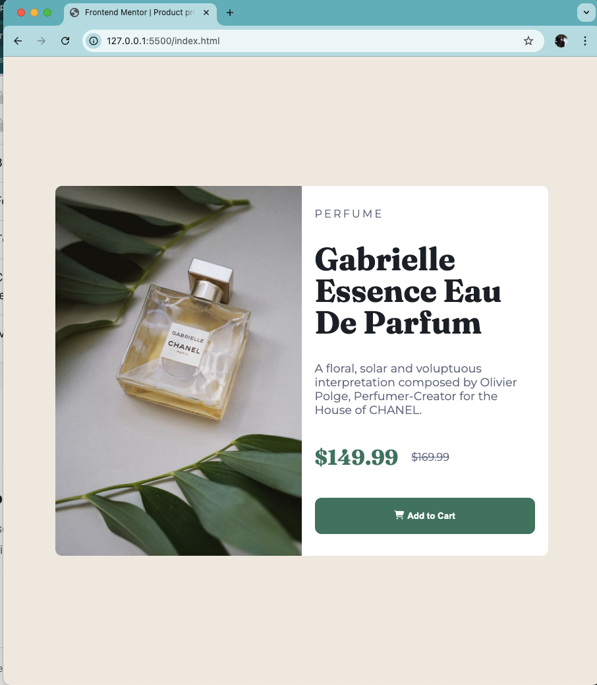

# Frontend Mentor - Product preview card component solution

This is a solution to the [Product preview card component challenge on Frontend Mentor](https://www.frontendmentor.io/challenges/product-preview-card-component-GO7UmttRfa). Frontend Mentor challenges help you improve your coding skills by building realistic projects. 

## Table of contents

- [Overview](#overview)
  - [The challenge](#the-challenge)
  - [Screenshot](#screenshot)
  - [Links](#links)
- [My process](#my-process)
  - [Built with](#built-with)
  - [What I learned](#what-i-learned)
  - [Continued development](#continued-development)
  - [Useful resources](#useful-resources)
- [Author](#author)
- [Acknowledgments](#acknowledgments)


## Overview

This project is to rehearse knowledge in using HTML, CSS and SASS to provide users with a consistent and optimal viewing experiences in both mobile and desktop view.

### The challenge

Using a pre-processor to custom css elements.

### Screenshot




### Links

- Solution URL: [Click here](https://github.com/niophan/product-preview-card-component-fe_5)
- Live Site URL: [Click here](https://niophan.github.io/product-preview-card-component-fe_5/)

## My process

### Built with

- Semantic HTML5 markup
- CSS custom properties
- Flexbox
- Mobile-first workflow
- Responsiveness


### What I learned

While working through this project i recap of how to apply somewhat basic SASS into practice. The scale of this project is relative low, in which SASS's modules and mixins are not necessary. Moreover, responsiveness is implemented with the help of media query and picture element, along with using percentages and em/rem units for width or height.

```html
<picture class="photo-box">
      <source srcset="image-product-desktop.jpg" media="(min-width: 45em)">
      
</picture>
```

```css
.container {
  background: $while-color;
  overflow: hidden;
  border-radius: 10px;
  margin: 20px;
  width: 80%;
}

img {
  display: block;
  max-width: 100%;
  object-fit: cover;
}
```

### Continued development

For this project, it is worth to use more SASS syntax in creating custom css.


### Useful resources


- [sass](https://sass-lang.com/guide/#modules)
- [media query](https://developer.mozilla.org/en-US/docs/Web/CSS/CSS_media_queries/Using_media_queries)
- [picture](https://web.dev/learn/design/picture-element)
- [responsive images](https://web.dev/learn/design/responsive-images)


## Author

- Frontend Mentor - [@niophan](https://www.frontendmentor.io/profile/niophan)
- Github - [@niophan](https://github.com/niophan)


## Acknowledgments

Thanks Frontend Mentor for this challenge.
